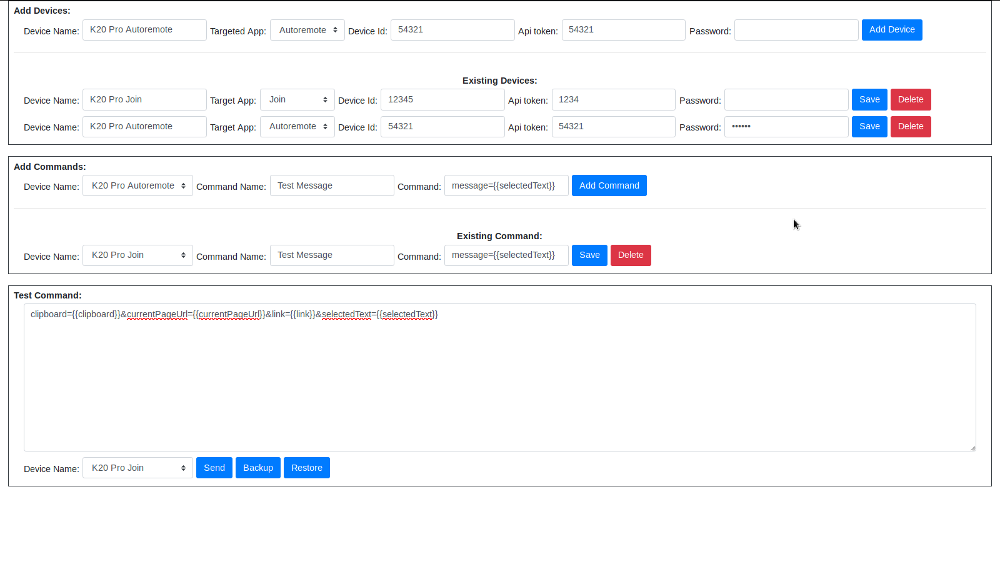
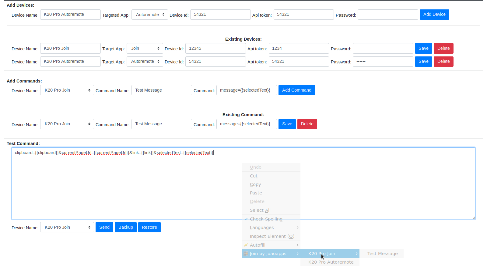

# Join Firefox Extension
Firefox Add-on for Join

## What it does

For now the extension only allows you to log-in and use the right click menu to push stuff to your devices

## What I have modified
- Add these few params so I can easily customize data sending back to Join or Autoremote
    - {{clipboard}}
    - {{currentPageUrl}}
    - {{link}}
    - {{selectedText}}
- Send message to Join or Autoremote without signin gmail account but no original feature available
- I have comment out original code because I normally don't sign in my gmail account and original code always open browser tab by itself when I open browser. (Wish I could add them together if possible)

## Download Link
[Download](join_by_joaoapps.xpi)

## Compatibility

This add-on has been tested on Firefox 49.0. (As of writing this is the [Nightly](https://nightly.mozilla.org/) version)
It needs some features that have been recently added so it may not work at all on lower versions.

## How to install and use

- In Firefox navigate to [about:debugging#addons](about:debugging#addons)
- Click "Load Temporary Add-on"
- Find the JoinFirefox folder
- Select the manifest.json file
- Log-in to your google account in the tab that pops-up
- Right-click any page to see the Join options
